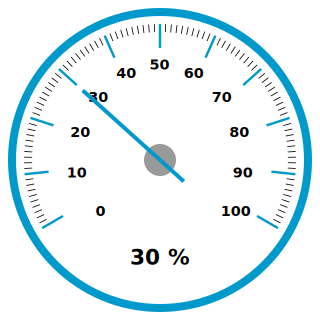

# d3gauge

**d3gauge.js** is an add-in for the [D3](http://d3js.org) javascript library for drawing gauges, based on the [google charts gauge](https://developers.google.com/chart/interactive/docs/gallery/gauge) and [this javascript implementation](http://tomerdoron.blogspot.nl/2011/12/google-style-gauges-using-d3js.html). Every aspect of a d3gauge can be customised by passing an object containing options (see below)



## Usage
To create a new d3gauge, add a div to your HTML document with a unique id, then call a new gauge object:

```
<div id="gaugeBox"></div>
```

then create a new drawGauge object, passing the div id

```
var gauges = []
gauges[0] = new drawGauge({divID : "gaugeBox"}); 
```

This will add a gauge ranging from 0 to 100%, and set the needle at 60%, as an example.
The gauge value can then be updated using the _updateGauge_ function within the new gauge object:

```
var newValue = 10
gauges[0].updateGauge(newValue)
```

## Options
The following options can be set:

### DOM
*o* **divID** - The div in which to place the gauge

### Gauge readings
* **minVal** - The minimum numeric value on the gauge
* **maxVal** - The maximum numeric value on the gauge
* **tickSpaceMinVal** - The numeric spacing of the minor increment ticks
* **tickSpaceMajVal** - The numeric spacing of the major increment ticks
* **needleVal** - The initial value of the needle
* **gaugeUnits** - The units text, which is placed at the bottom of the gauge


### Radial metrics
* **gaugeRadius** - The radius of the gauge in pixels
* **padding** - Padding between gauge radius and the outer circle of the gauge, as a % of the gauge radius
* **edgeWidth** - The thickness of the circle around the edge of the gauge, as a % of the gauge radius
* **tickEdgeGap** - Spacing between ticks and the outer circle, as a % of the gauge radius
* **tickLengthMaj** - Length of the major ticks, as a % of the gauge radius
* **tickLengthMin** - Length of the minor ticks, as a % of the gauge radius
* **needleTickGap** - Spacing between the  major ticks and furthest extent of the needle, as a % of the gauge radius
* **needleLengthNeg** - Length of the needle section extending beyond the centre of the gauge, as a % of the gauge radius
* **pivotRadius** - Size of the central 'pivot' circle, on which the needle sits, as a % of the gauge radius

### Other metrics
* **ticknessGaugeBasis** - Scaling factor for thickness metics.  The scaling factor is determined as (gaugeRadius / ticknessGaugeBasis)
* **needleWidth** - Width of the needle in pixels
* **tickWidthMaj** - Widths of the major tick marks in pixels
* **tickWidthMin** - Width of the minor tick marks in pixels
* **labelFontSize** - Size of the tick mark labels in pixels
* **zeroTickAngle** - The position angle (in degrees) of the lowest value tick
* **maxTickAngle** - The position angle (in degrees) of the highest value tick
* **zeroNeedleAngle** - The lowest needle angle.  If a needleVal < minVal is set, then the needle will go to this position.
* **maxNeedleAngle** - The highest needle angle.  If a needleVal > maxVal is set, then the needle will go to this position.

### Colours & fonts
* **tickColMaj** - Colour of the major ticks
* **tickColMin** - Colour of the minor ticks
* **outerEdgeCol** - Colour of the outer circle
* **pivotCol** - Colour of the central pivot circle
* **innerCol** - Colour of the gauge face
* **unitsLabelCol** - The colour of the units text, at the bottom of the gauge
* **tickLabelCol** - The colour of the tick labels
* **needleCol** - The colour of the needle
* **tickFont** - The font of the tick labels
* **unitsFont** - The font of the units text, at the bottom of the gauge

## More Info
For more information on how the code works, see this [blog post](http://datamusing.com)
